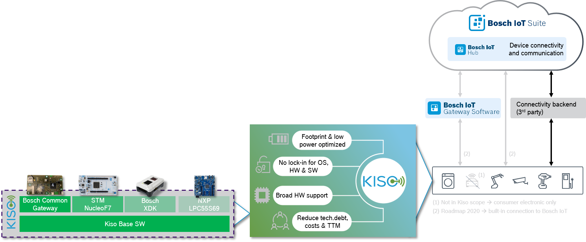

# Kiso   #

 
## Introduction ##
Kiso (Japanese for "basis") is an Eclipse Foundation software development kit (SDK) for internet of things (IoT) devices. It’s historical SW roots go back to 2013.

Eclipse Kiso’s original code base is the Bosch Connected Devices Development Kit (CDDK) that has been used to develop several industrial and end-user products. The Kiso project is - right now - transferring CDDK’s proprietary license code piece-by-piece to EPLv2 open source. 
The responsible Bosch team at the Automotive Electronics ([AE](https://www.bosch-mobility-solutions.com/)) Software Campus is looking to raise the in-house profile of this hidden treasure with its 500,000 lines of code so that all developers can make direct use of its collection of programming tools and program libraries for their IoT applications.
Developed and put through its paces by AE or – more specifically – Bosch Connected Devices and Solutions ([BCDS](https://www.bosch-connectivity.com/)), the kit can now be used by everybody as a basis for developing their IoT applications. Eclipse Kiso’s reusability, robustness and tailored integration into the Bosch IoT ecosystem ([Bosch.IO](https://bosch.io/)) are key features, especially given that it’s not tied to any particular operating system.

Kiso can be customized, and its functions can also be standardized for use with entire product families and generations. It’s quality goals - understandability, usability, product quality, extensibility and performance - are factors that enable a fast prototype and product development. By this, it reduces the time to market together with minimizing technical debts for almost all kinds of IoT "Things".

## Scope ##
To learn what Kiso is and how it can help you, please have a look at our [scope](http://kiso.rempler.de:1313/project-overview/scope.html) page.

## Quick start ##
Please take a look at the [quick start](http://kiso.rempler.de:1313/user-guide/quick_start.html) section in the user manual documentation.

## Support ##
Community support is provided via Mattermost, see [Kiso channel](https://mattermost.eclipse.org/eclipse/channels/kiso). An Eclipse Foundation Mattermost account is needed.

## Resources ##
Please note that (for now) some of the following links may require additional accounts and/or are limited to Bosch infrastructure access. This is a temporary impediment until Kiso's infrastructure has been moved over to Eclipse Foundation.
* User manual: [documentation](http://kiso.rempler.de:1313/)
* Architecture: [architecture overview](http://kiso.rempler.de:1313/concepts/overall_architecture.html)
* Frequently asked questions: [FAQ](http://kiso.rempler.de:1313/frequently-asked-questions.html)
* API documentation: [Doxygen documentation](http://kiso.rempler.de:8080/)
* Release notes (inkl. features, supported reference HW and known issues): [release notes](https://github.com/eclipse/kiso/blob/master/RELEASE_NOTES.md)
* Continuous integration (automated testing results): [Jenkins dashboard](https://ci.eclipse.org/kiso)
* Eclipse Foundation project page: [Eclipse Kiso](https://projects.eclipse.org/projects/iot.kiso)
